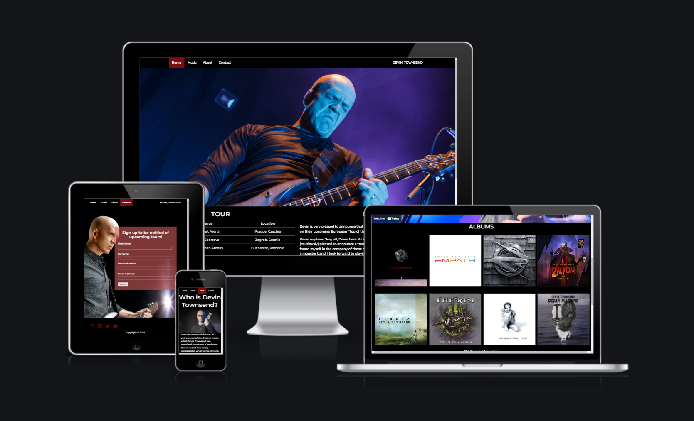
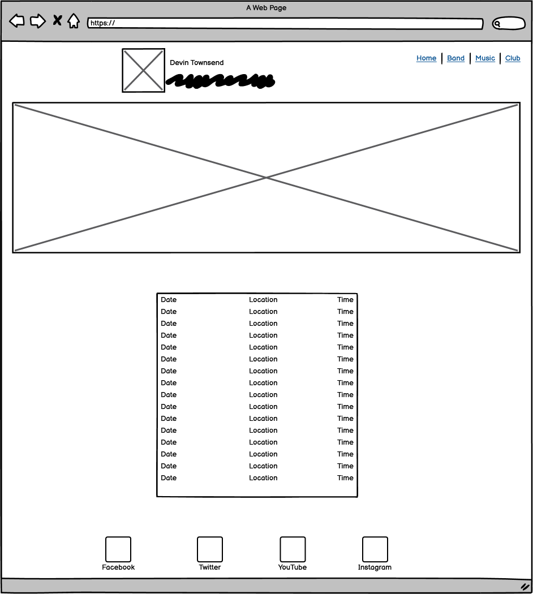
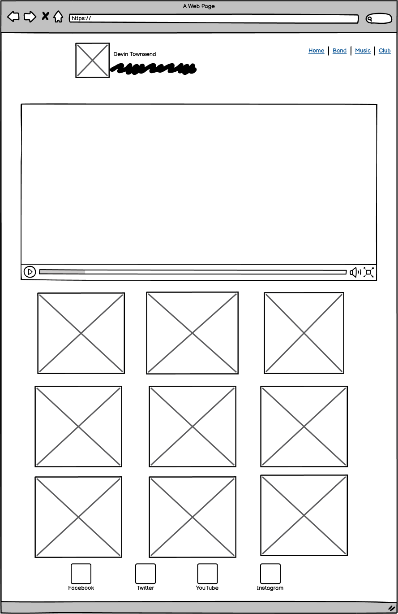
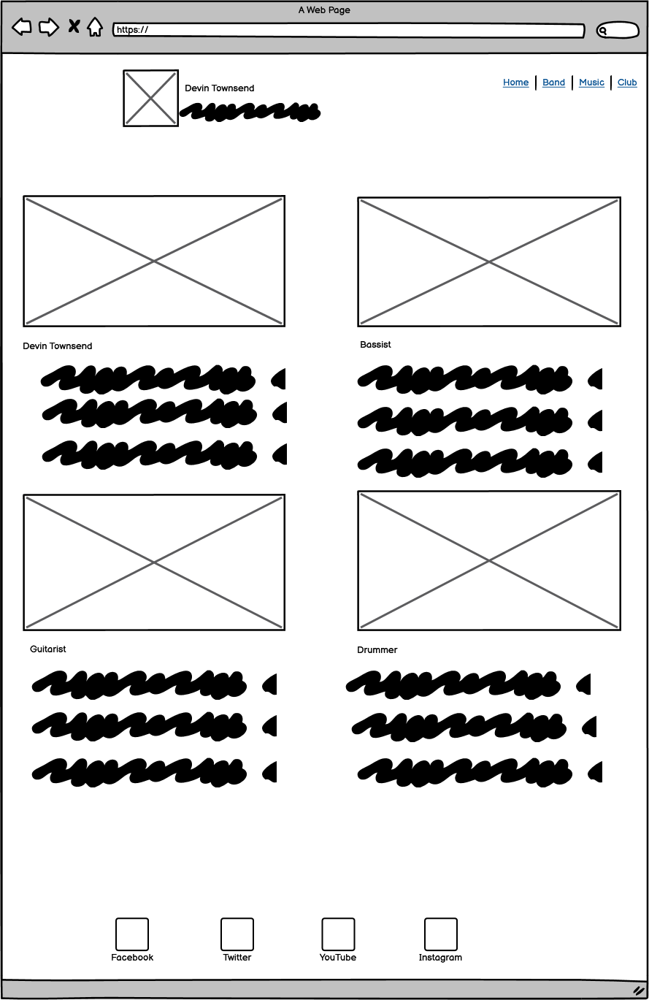
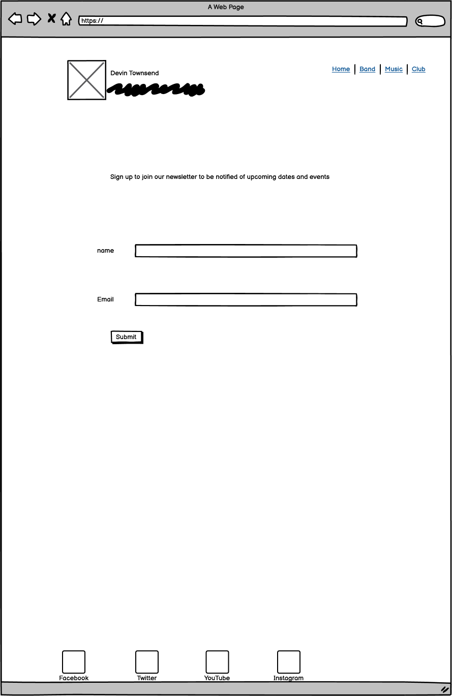

# [Devin Townsend Project](https://andrewrbrennan.github.io/devin-townsend-project/)

A website for my personal favourite musician.

## Disclaimer

The contents of this site are purely for educational purposes and all images and music belongs to their respective owners, furthemore this site will only be deployed for assessment purposes only.

# About

I was struggling to find a topic that appealed to me for this project. I floated a fair few ideas around in my head before deciding on this one. I felt that since it was something I cared about, I would be able to put much more effort into it. I tried not to take any inspiration from the actual site that exists for his music. The only real inspiration I took was using an underscore in his name for the header. I wanted to make sure that if somoen had never heard of him before, this small site would have enough infor to tell you what he's all about and provide a selection of music for potential newcomers to check out

# UI/UX Aims

Since the music is of the heavier sort, I figured I would go with a tried and tested colour scheme of red & black. The colour play well off one another and look great on screen. I used the Montserrat font for the site as I felt that it suited the look and general feel of the site. 

On the main page the goal was to show some general info so I have the upcoming tourdates and a bit of recent news to show what he's been up to. The about page is a short bio of his career so far so a usewr can easily get up to speed on the artist. I put a good bit of effort into making the music page well rounded and has a faior bit of content for a user to access. It has an embedded music video along with links to the albums that have been released under the Devin Townsend moniker. However since he has been in a number of bands over the years I opted for linking two of his most famous ones with embedded spotify playlists at the bottom of the page. The signup page functions as a newsletter that will inform you of any future tours that get announced. 

I feel like the site reaches the goal of letting the user access the content they want in as few sections as possible. 

### Wireframes

I feel that I achieved most of what my intent was with the wireframes, they were put together with the help of my mentor. Admittedly in the future I will spend more time on them before beginning a project.

# Website Sections & Features

### Home

The first thing the user is greeted with is a large picture of Devin Townsend doing what he does best, screaming into the microphone. I aimed to have thsi picture or at least a version of it be used across all devices which necessitated me cropping it and saving various versions of it. I briefly thought about using a different image on each responsive version of the site, bit opted to stick for the one I used on the desktop version for site parity. Below this image are some columns containing the upcoming tour dates and and some recent news concerning the band. I also provided a video embedd of the latest Devin Townsend Podcast. 

### Music

On this page I give the user access to a selection of music in different ways. AT the beginning of the page I have an embedded youtube page that scales with the size of the window. It should fill it no matter what. Below that I have a selection of his albums in bootstrap containers. Each of these albums uses flip card code so that when the user interacts with them the album artwork flips over providing a link to that album on spotify, which the user can then click though and access. Below this I have embedded two spotify playlist for his other bands that he has been a member of. I feel that with the content on offer here the user can definitely see what he's all about.

### About

This page serves as a simple bio for Devin Townsend. It's a short enough read but it does what it needs to which is provide the user with information about the artist if they are visiting the site and know nothing about him.

### Contact

On this page the user can sign up for a newsletter and they will be sent a list of any upcoming tourdates for the artist. This is purely hypothetical for now as the site isn't real but I would love to be able to learn how to develop that functionality in the future.

### Footer

The footer on every page provides links to the social media pages of Devin Townsend. Users can easily access his Facebook, Twitter, Instagram and YouTube pages. if he had a TikTok page I would have added it too.

# Technologies Used

**HTML & CSS** The website was built and styled with HTML & CSS

**Github** Was used for hosting the live site and storing the code used to create it
 
**Gitpod** Was used to code the site using it's editor and display a running preview of the site

**Bootstrap** Used for layout purposes in the site, getting items to line up correctly for the user, articles, embedded code, flipcards for example.
 
**Font Awesome** Used for social media icons

**Spotify** Used for links to albums and embeded playlists

**Youtube** Used for embedded videos. 

**Chrome** Website was built in Google Chrome

# Testing

The website was tested using a selection of browsers and devices that I have on hand I used a few computers with screens of varying sizes. 
 - Chrome, Chrome Dev tools on PC, mobile and iPad
 - Safari on iPad
 - Mozilla Firefox on PC
 - Microsoft Edge Browser on PC
 - On different resolution screens that I have access to 4K, 1440p and 1080p

 I went through each link on each page and clicked through them all to ensure that they had the desired result. 

 - Nav bar links work correctly on each page.
 - Form submit works correctly and lets you know that it has worked, the user recieves a message and is then brought back to the home page of the site. The user also cannot fill the sections with incorrectly or else submit will not function. 
 - Social media links in the footer all link to the correct sites
 - Embedded videos are correct when played
 - All albums have a working link to the correct album on spotify attached to the back side of the flipbox
 - Embedded playlists play the correct band and music when clicked.
 - CSS was validated correctly and returned no issues from the Validator https://jigsaw.w3.org/css-validator/
 - Used WAVE addon to check for any issues on each page of the site

# DEPLOYMENT

## Using Github Pages

In the GitHub Repository from the project https://github.com/andrewrbrennan/devin-townsend-project

1. Click the 'Settings' Tab.
2. Click on the Git Hub Pages Heading on the sidebar.
3. Select Branch 'Main' as the source and save.
4. At the GitHub pages heading there will now be a link https://andrewrbrennan.github.io/devin-townsend-project/
5. Click this link for the live deployed page

# Future Features I would like to Implement

- I would love to add more to the music section of the site, have the whole discography there. 
- Add a proper hamburger bar menu to the site. This was something I had planned on implementing but sadly could not get it to work in time. 
- More sections in the about page, former and current touring members of the band with short bios
- I would also like to learn how to send ana generic email as a confiormation for signing up on the website. 

# Code Credits

- Implementing a table on the site https://www.w3schools.com/tags/tag_tbody.asp

- Help with changing the colour of a table header https://developer.mozilla.org/en-US/docs/Web/HTML/Element/th

- Adding social media buttons https://www.w3schools.com/howto/howto_css_social_media_buttons.asp

- Bootstrap info on how to properly create and style columns 
    1. https://getbootstrap.com/docs/4.0/layout/overview/
    2. https://www.w3schools.com/bootstrap4/bootstrap_grid_system.asp

- How to create a flip card for album artwork https://www.w3schools.com/howto/howto_css_flip_card.asp

- Creating a navigation bar https://www.w3schools.com/howto/howto_js_topnav.asp

- Adding a function to let you know when you have submitted a form https://www.w3schools.com/tags/ev_onsubmit.asp

- How to embed a video to full viewport width https://www.youtube.com/watch?v=9YffrCViTVk&ab_channel=tipswithpunch

- Signup form adapted from love running project

# Media Credits

- Youtube videos embedded from Devin Townsend's official page

- Spotify music embedded from Devin Townsend, Devin Townsend Project & Strapping Young Lad's official pages

- Hero Image from https://www.sonicperspectives.com/news/devin-townsend-announces-eras-high-quality-vinyl-collection-work/

- Album artwork from https://en.wikipedia.org/wiki/Devin_Townsend

- about section image from https://www.imdb.com/name/nm1648458/

- Contact section image from https://www.stubhub.ie/devin-townsend-project-tickets/performer/492863/

