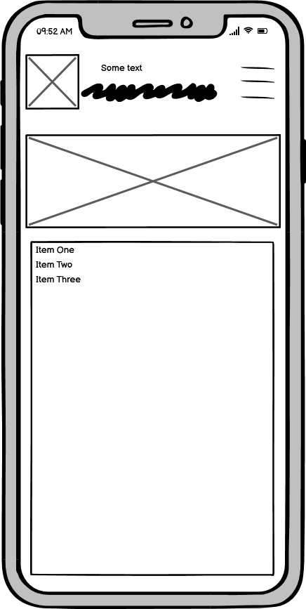

# [Devin Townsend Project](https://andrewrbrennan.github.io/devin-townsend-project/)

A website for my personal favourite musician.

## Disclaimer

The contents of this site are purely for educational purposes and all images and music belongs to their respective owners, furthemore this site will only be deployed for assessment purposes only.

# About

I was struggling to find a topic that appealed to me for this project. I floated a fair few ideas around in my head before deciding on this one. I felt that since it was something I cared about, I would be able to put much more effort into it. I tried not to take any inspiration from the actual site that exists for his music. The only real inspiration I took was using an underscore in his name for the header. I wanted to make sure that if somoen had never heard of him before, this small site would have enough infor to tell you what he's all about and provide a selection of music for potential newcomers to check out

# UI/UX Aims

Since the music is of the heavier sort, I figured I would go with a tried and tested colour scheme of red & black. The colour play well off one another and look great on screen. I used the Montserrat font for the site as I felt that it suited the look and general feel of the site. 

On the main page the goal was to show some general info so I have the upcoming tourdates and a bit of recent news to show what he's been up to. The about page is a short bio of his career so far so a usewr can easily get up to speed on the artist. I put a good bit of effort into making the music page well rounded and has a faior bit of content for a user to access. It has an embedded music video along with links to the albums that have been released under the Devin Townsend moniker. However since he has been in a number of bands over the years I opted for linking two of his most famous ones with embedded spotify playlists at the bottom of the page. The signup page functions as a newsletter that will inform you of any future tours that get announced. 

I feel like the site reaches the goal of letting the user access the content they want in as few sections as possible. 

### Wireframes

I feel that I achieved most of what my intent was with the wireframes, they were put together with the help of my mentor. Admittedly in the future I will spend more time on them before beginning a project.

# Website Sections & Features

### Home

The first thing the user is greeted with is a large picture of Devin Townsend doing what he does best, screaming into the microphone. I aimed to have thsi picture or at least a version of it be used across all devices which necessitated me cropping it and saving various versions of it. I briefly thought about using a different image on each responsive version of the site, bit opted to stick for the one I used on the desktop version for site parity. Below this image are some columns containing the upcoming tour dates and 

